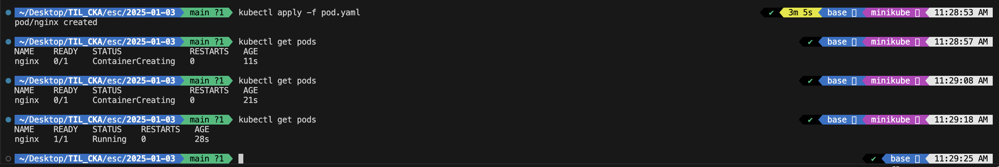
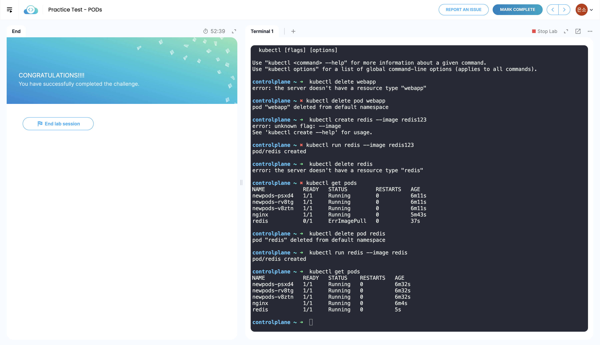

## 18. Pods

애플리케이션이 이미 개발되어 도커 이미지에 빌드되어 있고, 도커 리포지토리에서 사용할 수 있으므로 실행 중인 k8s 클러스터가 이를 사용할 수 있다고 가정함 
목표: 클러스터의 워커 노드로 구성된 머신 세트에 컨테이너 형태로 애플리케이션을 배포하는 것

컨테이너는 파드라는 쿠버네티스 오브젝트로 캡슐화됨 
파드는 애플리케이션의 단일 인스턴스로 쿠버네티스에서 생성할 수 있는 가장 작은 오브젝트임 
일반적으로 애플리케이션을 실행하는 컨테이너와 파드가 1대1 관계를 가짐 
애플리케이션을 확장하기 위해서는 새 파드를 추가하는 것이 맞지만, 웹 애플리케이션을 지원하는 헬퍼 컨테이너의 경우 하나의 파드에 2개의 컨테이너가 있을 수 있음 
동일한 파드에 있는 컨테이너는 동일한 네트워크 공간을 공유하기 때문에 서로를 localhost라고 지칭하여 직접 통신 및 동일한 저장 공간을 공유 가능함 
파드가 어떤 컨테이너로 구성되는지 정의하기만 하면 기본적으로 파드의 컨테이너는 동일한 스토리지, 네트워크, 네임스페이스에 액세스할 수 있으며 수명 주기가 동일해 아키텍처 변경 및 확장에 대비하기 좋음

- `kubectl run nginx --image nginx`: nginx 이미지를 DockerHub 리포지토리에서 다운받아 파드를 생성하고 nginx 도커 이미지의 인스턴스를 배포함
- `kubectl get pods`: 클러스터의 파드 목록 확인
- `kubectl describe pod <pod-name>`: 파드의 세부 사항 확인

 

## 19. Pods with YAML

yaml: 파드, 레플리카, 배포, 서비스 등과 같은 오브젝트를 생성하기 위한 입력, apiVersion, kind, metadata, spec의 최상위 필드는 필수적으로 포함됨 
yaml 파일은 `kubectl create -f pod.yaml` 명령어로 작성된 요소를 생성 가능함
- apiVersion: 오브젝트를 생성하는 데 사용되는 Kubernetes API의 버전
- kind: 생성하려는 객체의 유형
- metadata: 이름(string), 레이블(dictionary) 등과 같은 개체에 대한 데이터, dictionary 형식, depth 중요
- spec: 오브젝트에 관한 추가 정보 작성
    - pod의 경우 containers에 name과 image를 작성하면 됨

 

## 20. Demo - Pods with YAML

  

pod.yaml 작성 후 파드 생성 
 

## 23. Lab - Pods

  

- kubectl get pods
- kubectl run nginx --image nginx
- kubectl describe pod newpods-psxd4
- kubectl delete pod webapp