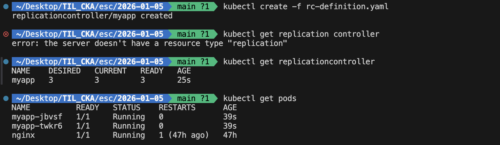
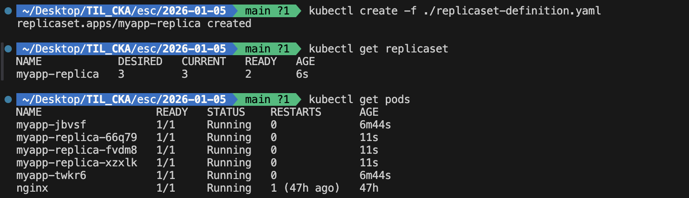
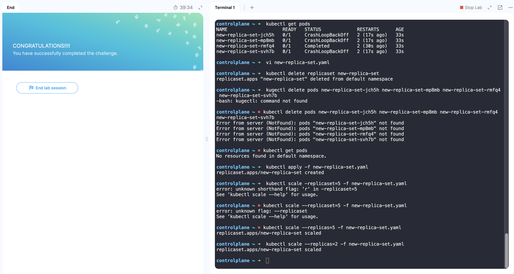
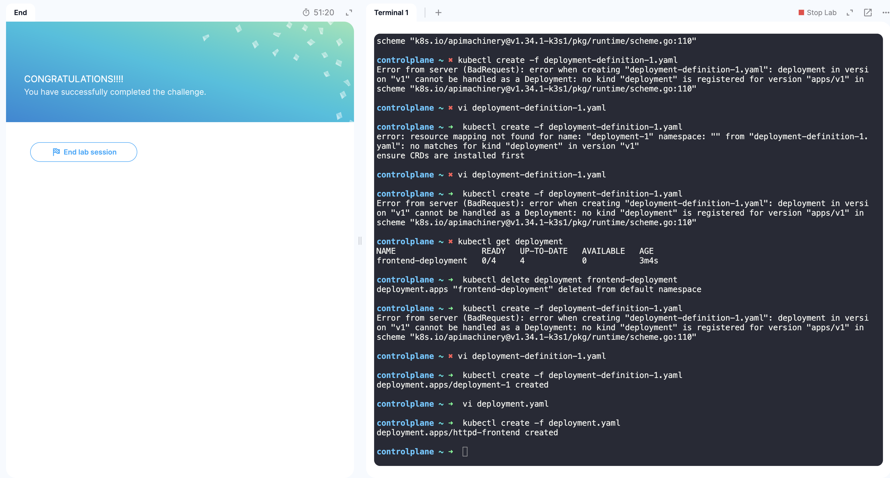

## 25. Recap - ReplicaSets

지정된 개수의 파드가 동작하도록 보장하는 요소 
복제 컨트롤러는 쿠버네티스 클러스터에서 단일 파드의 여러 인스턴스를 실행하는 데 사용됨 - 고가용성 제공 
단일 파드 구조더라도 복제 컨트롤러로 기존 파드가 실패하면 자동으로 새 파드를 불러오는 구조 사용 가능

부하 분산을 위해서 복제 클러스터를 사용함 
사용자 수가 증가하면 추가 파드를 배포하여 파드 간의 부하를 분산시킴 
노드의 유휴 자원이 부족해지면 추가로 노드를 생성하고, 해당 노드에 추가 파드를 배포할 수 있음 
여러 노드의 여러 포드에 걸쳐 부하를 분산하고, 수요가 증가할 때 애플리케이션을 확장 가능함

Replication Controller는 ReplicaSet으로 대체되는 구형 기술임

[re-difinition.yaml](/esc/2026-01-05/rc-definition.yaml) 파일 작성  
  

[re-difinition.yaml](/esc/2026-01-05/rc-definition.yaml) 파일 작성  
  

 

ReplicaSet의 역할은 파드를 모니터링하고 파드 중 하나라도 실패하면 새 파드를 배포하는 것임 
모니터링할 파드는 selecor의 matchLabels를 이용해 일치하는 labels를 가진 파드를 모니터링함

replicaset의 복제본 수를 변경하는 방법은 다음과 같다:
- replicaset-definition.yaml 파일의 replicas 개수 변경
- `kubectl scale --replicas=6 -f replicaset-definition.yaml` 명령어 사용
- `kubectl scale --replicas=6 replicaset myapp-replicaset` 명령어 사용
    - scale 명령어를 사용한 경우 파일에 작성된 replicas 개수는 변경되지 않음

 

사용 명령어:
- kubectl create -f replicaset-definition.yaml
- kubectl get replicaset
- kubectl delete replicaset myapp-replicaset
- kubectl replace -f replicaset-definition.yaml
- kubectl scale -replicas=6 -f replicaset-definition.yaml

 

## 26. Lab - ReplicaSets

  
- kubectl get pods
- kubectl get replicaset
- kubectl describe replicaset new-replica-set
- kubectl apply -f /root/replicaset-definition-1.yaml

 

## 28. Deployment

1. 여러 개의 인스턴스로 웹 서버 실행
2. 도커 인스턴스 버전 업데이트 시 롤링 업데이트 가능
3. 환경 확장, 리소스 할당 수정 등의 변경 사항을 함께 롤아웃 가능

Deployment를 통해 롤링 업데이트를 사용하여 기본 인스턴스를 원활하게 업그레이드하고, 변경 사항을 실행 취소하고, 필요에 따라 변경 사항을 일시 중지했다가 다시 시작할 수 있음 
replicaset-definition.yaml의 kind 부분만 Deployment로 변경하면 끝

`kubectl get replicaset` 명령어를 입력해도 deployment가 나옴 
생성된 모든 오브젝트를 한번에 확인: `kubectl get all`

 

## 30. Lab - Deployment

  