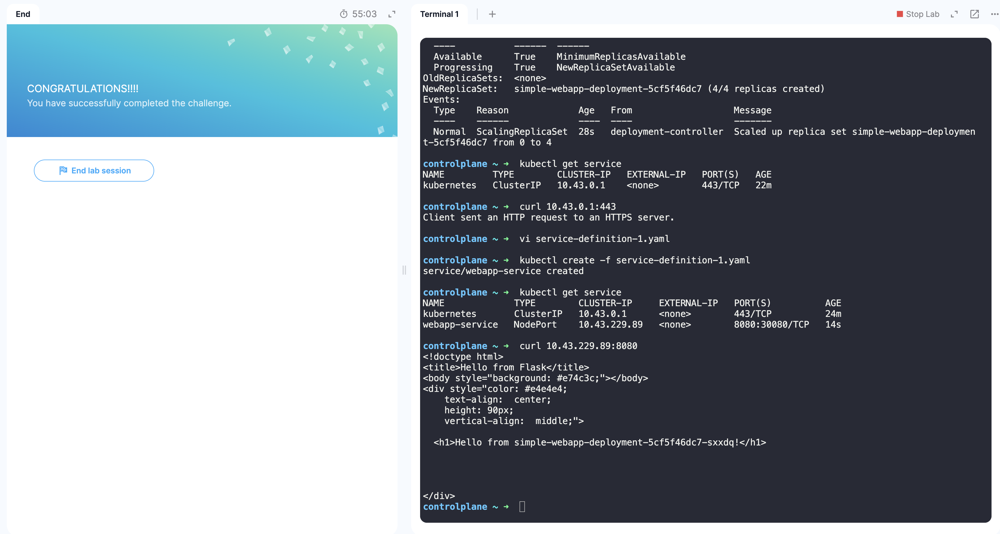
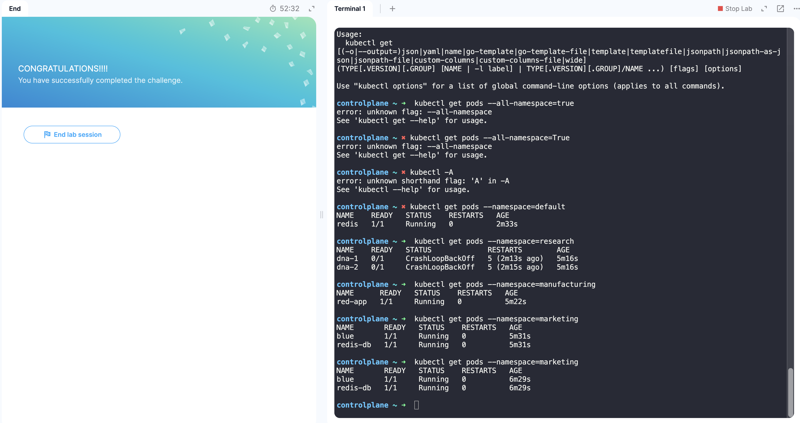

## 33. Services

애플리케이션 내부와 외부의 다양한 구성 요소 간의 포드 통신 지원

외부 통신의 경우
- 노드 IP: 192.168.1.2
- 노트북 IP: 192.168.1.10
- 내부 파드 네트워크: 10.244.0.0 - 파드 IP: 10.244.0.2

 

현재 상태에서 파드에 접속하려면 ssh 접속 후 curl http://10.244.0.2를 날리는 방법밖에 없음 
따라서 노트북에서 노드로, 노드를 통해 웹 컨테이너를 실행하는 파드로 요청을 매핑하는 데 **Service**가 사용됨 
Service는 노드에서 포트를 수신하고 해당 포트의 요청을 웹 애플리케이션을 실행하는 파드의 포트로 전달함 = 포트 서비스 = NodePort

- Target Port: 서비스가 요청을 전달하는 포트
- Port: 서비스 자체의 포트
    - 서비스 = 노드 내부의 가상 서버, 서비스의 클러스터는 자체 IP 주소를 가짐
- NodePort: 노드 자체에 외부에서 액세스하는 데 사용하는 포트, 30000-32767 사이의 값만 가능함

 

[service-definition 작성](/esc/2026-01-06/service-definition.yaml)  
ports 부분에서 port만 필수 작성이며 targetPort는 port와 동일한 값으로, nodePort는 30000-32767 사이의 포트가 자동 할당됨 
service는 자동으로 레이블과 일치하는 다수의 파드에 대해 엔드포인트로 선택하여 무작위 알고리즘으로 사용자로부터 오는 외부 요청을 전달함 
파드가 여러 노드에 분산되어 있는 경우 서비스를 생성하면 자동으로 노드에 걸쳐 생성되며, 대상 포트를 클러스터의 모든 노드에 있는 동일한 노드 포트에 매핑함  
파드가 제거되거나 추가되면 서비스가 자동으로 업데이트됨

서비스 종류
- NodePort: 서비스가 노드의 포트에서 내부 파드에 액세스할 수 있도록 하는 노드 포트
- ClusterIP: 클러스터 내부에 가상 IP를 생성하여 서로 다른 서비스 간의 통신을 가능하게 함
- LoadBalancer: 지원되는 클라우드 제공 업체에서 애플리케이션을 위한 로드 밸런서를 프로비저닝

 

## 34. Services - ClusterIP

서비스 또는 애플리케이션의 계층 간에 설정을 연결하는 방법
파드를 함께 그룹화하고 그룹 내 파드에 액세스할 수 있는 단일 인터페이스 → 마이크로서비스 기반 애플리케이션 배포에 도움
각 계층은 다양한 서비스 간의 통신에 영향을 주지 않고 필요에 따라 확장 또는 이동 가능
각 서비스에는 클러스터 내에서 IP와 이름이 할당되며, 다른 경로에서 서비스에 액세스할 때 사용됨 = ClusterIP

[service-definition 작성](/esc/2026-01-06/service-definition-clusterip.yaml)  
Service의 기본 타입은 ClusterIP이므로 해당 부분을 공란으로 작성하면 ClusterIP로 작성됨

 

## 35. Services - Loadbalancer

4개의 노드 클러스터에서 외부 사용자가 애플리케이션에 액세스할 수 있도록 하기 위해 NodePort를 생성함 
NodePort 유형의 Service는 노드의 포트에서 트래픽을 수신하고 각 파드로 트래픽을 라우팅하는 역할을 함 
사용자에게 애플리케이션에 액세스할 수 있도록 노드 IP와 서비스가 노출된 포트를 사용하여 액세스할 수 있으나, 단일 URL을 이용해 모든 애플리케이션에 액세스할 필요가 있음 
이 경우 로드 밸런서 용도로 새 가상 머신을 생성하고 nginx 등을 설정하여 기본 노드로 트래픽을 구성하도록 설정할 수 있으나 유지 및 설정이 어려움 
로드밸런서를 지원하는 클라우드 플랫폼(GCP, AWS, Azure)의 기본 로드 밸런서와 통합하여 로드밸런서를 구성할 수 있음 
프론트엔드 서비스의 서비스 유형을 NodePort 대신 LoadBalancer로 변경하면 됨 
로드밸런서를 지원하지 않는 VirtualBox 같은 환경에서 로드밸런서를 설정하면 노드의 하이엔드 포트에 서비스가 노출되는 것을 할고 있는 노드 포트로 연결하는 효과를 얻게 됨

 

## 36. Lab - Service

  

 

## 38. Namespaces

default namespace는 kubernetes에 의해 자동으로 생성됨
클러스터를 처음 설정할 때 kubernetes는 네트워킹 솔루션, DNS 서비스 등에 필요한 것과 같은 내부 목적을 위해 파드 및 서비스 세트를 생성하고, 사용자와 서비스를 격리하기 위해 다른 네임스페이스에 kube-system이라는 이름의 네임스페이스를 생성함. 그 뒤에는 kube-public을 생성해 모든 사용자가 사용할 수 있는 리소스가 생성됨
엔터프라이즈 혹은 프로덕션 목적으로 쿠버네티스 클러스터를 확장하여 사용하는 경우 네임스페이스 사용을 고려할 수 있음
네임스페이스 각각은 자체 정책 집합 또는 리소스 할당량을 가질 수 있음
동일한 네임스페이스의 요소는 이름으로 부를 수 있고, 다른 네임스페이스의 요소를 부르기 위해서는 `<서비스 이름>.<네임스페이스 이름>.svc.cluster.local` 형식으로 작성해야 함

- kubectl get pods --namespace=dev : dev namespace의 파드 확인
- kubectl create -f pod-definition.yaml --namespace=dev: dev namespace에 파드 생성
- kubectl config set-context $(kubectl config current-context) --namespace=dev
    - 생성 시 metadata 부분에서 namespace: dev를 추가하면 해당 네임스페이스에서 생성됨
- kubectl create -f [namespace-dev.yaml](/esc/2026-01-06/namespace-dev.yaml)
    - 동일하게 kubectl create namespace dev로 생성 가능
- kubectl get pods --all-namespace
- kubectl create -f [compute-quota.yaml](/esc/2026-01-06/compute-quota.yaml):할당량 제한

 

## 39. Lab - Namespaces

  
- kubectl get pods --namespace=default = kubectl get pods -n=default
- kubectl get pods --all-namespace = kubectl get pods -A
- 동일한 네임스페이스에서는 응용 프로그램은 다른 서비스 이름으로 접근 가능함