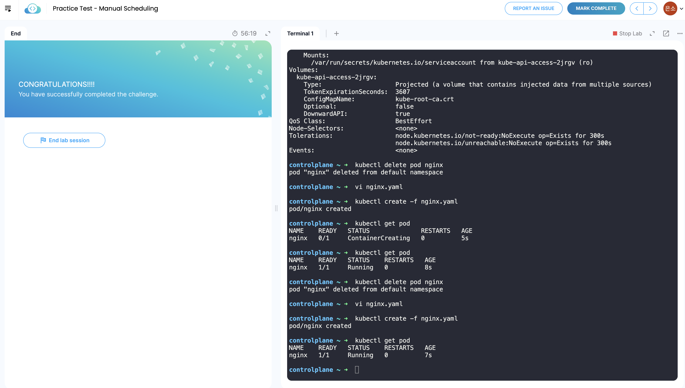

## 52. Manual Scheduling

기본 제공 스케줄러에 의존하지 않고 직접 파드를 스케줄링하고 싶을 수 있음<br>
모든 파드에는 기본적으로 설정되지 않은 `nodeName` 필드가 있으며, 이것은 일반적으로 정의하지 않고 쿠버네티스가 자동으로 입력함<br>
스케줄러는 모든 파드를 살펴보고 이 속성이 설정되어 있지 않은 파드를 찾아 스케줄링 후보로 정하고, 스케줄링 알고리즘을 실행하여 파드에 적합한 느드를 식별해 바인딩 오브젝트를 생성하여 `nodeName`을 노드 이름으로 설정해 노드에서 파드를 스케줄링함

노드에 파드를 모니터링하고 스케줄링하는 스케줄러가 없다면 파드는 계속 보류 중 상태임<br>
이때 노드에 직접 수동으로 파드를 할당할 수 있음<br>
스케줄러 없이 파드를 스케줄링하는 가장 쉬운 방법은 파드를 생성할 때 `nodeName` 필드를 파드 사양 파일의 노드 이름으로 설정해 파드를 지정된 노드에 할당하는 것임

파드가 이미 생성되어 있는데 노드에 파드를 할당하려는 경우 파드의 `nodeName` 속성을 수정하는 것을 허용하지 않음<br>
따라서 [바인딩 오브젝트](/esc/2026-01-09/pod-bind.yaml)를 생성하고 포스트 요청을 파드 바인딩 API로 전송하여 실제 스케줄러가 바인딩 오브젝트에서 수행하는 작업을 모방해 노드에 파드를 할당할 수 있음

<br>

## 53. Lab-Manual Scheduling

 <br>
`kubectl describe pod nginx`를 했을 때 별도의 오류가 발생하지 않았는데 Node가 지정되지 않은 Pending 상태이면 Scheduler가 없는 상태를 의심해볼 수 있음<br>
`kubectl get pods -n kube-system` 명령어를 보면 scheduler가 없는 것을 확인할 수 있음<br>
한 시스템에서 다른 시스템으로 포드를 옮길 방법이 없으므로 하나의 시스템이나 노드에서 파드를 삭제하고 다른 곳에서 다시 생성해야 함<br>
이 경우 `kubectl replace --force -f nginx.yaml`로 nginx.yaml로 생성되는 파드를 이동할 수 있음

<br>

## 55. Labels and Selectors

labels와 selectors는 항목을 그룹화하는 표준<br>
label로 각 항목에 해당 클래스에 대한 속성을 추가하고, selector를 사용해 항목을 필터링해 그룹화함<br>
쿠버네티스에서는 pod, service, replicaset, deployment 등 다양한 유형의 객체를 그룹화하거나 애플리케이션 또는 기능별로 필터링하고 보기 위해 label과 selector이 사용됨<br>
labels는 정의 파일의 metadata 아래의 파드 정의 파일에서 labels이라는 색션에 key-value 형식의 값을 추가하여 생성함. 개수 제한 X<br>
그 뒤 `kubectl get pods --selector app=App1`같은 명령어로 필터링 한 파드만 확인할 수 있음

ReplicaSet의 경우 template 아래에 정의된 label은 파드에 지정되고, 상단 metadata에 정의된 label은 ReplicSet에 지정됨.<br>
이때 ReplicaSet의 selector의 matchLabels의 값은 파드의 label 값과 동일해야 함<br>
동일한 label이 있는 경우 label을 추가하여 구분할 수 있어야 함<br>
Service, Deployment 등도 동일하게 작성함

Annotation(주석)은 정보 제공을 위한 기타 세부 정보를 기록하는 데 사용됨<br>
예를 들어 이름 버전, 빌드 정보 등과 같은 도구 세부 정보나 연락처, 이메일 등의 다른 정보가 있을 수 있음<br>
기록은 labels와 같은 depth에서 `annotations:` 하고 label과 동일하게 작성하면 됨

<br>

## 56. Lab - Labels and Selectors

<br>
- kubectl get pods --selector env=dev
- kubectl get pods --selector bu=finance
- kubectl get all --selector env=prod | wc -l
- kubectl get all --selector env=prod,bu=finance,tier=frontend

<br>
<br>

## 58. Taints and Tolerations

파드와 노드 간의 관계, 어떤 파드가 어떤 노드에 배치되는지 제한하는 방법에 대해 설명함

[살충제 예시 참고](https://gngsn.tistory.com/282)<br>
taints와 tolerations는 노드에서 스케줄할 수 있는 파드에 대한 제한을 설정하는 데 사용됨

파드가 생성되면 쿠버네티스 스케줄러는 파드를 워커 노드에 배치하려고 시도함<br>
제한이 없을 때는 스케줄러가 모든 노드에 걸쳐 파드를 배치하여 균형을 맞춤

하지만 노드 1에 특정 사용 사례 또는 애플리케이션을 위한 전용 리소스가 있다고 가정해보자.<br>
이 경우 애플리케이션에 속하는 부분만 노드 1에 배치하고 싶음<br>
→ Node 1에 **taint**를 설정해서 모든 파드가 노드에 배치되는 것을 방지하고, 배치하고 싶은 노드만 **tolerate**를 설정해 Node 1에 배치함<br>
taints는 노드에 설정되고 tolerate는 파드에 설정된다는 것을 기억해야 함

노드를 taint하려면 `kubectl taint nodes <node-name> key=value:<taint-effect>`를 지정하면 됨<br>
taint-effect는 tolerate가 없을 때 파드의 동작을 지정하는 것으로, 총 3가지가 있음
- NoSchedule: 노드에 파드가 스케줄되지 않음
- PreferNoSchedule: 시스템이 노드에 파드를 배치하지 않으려는 것을 의미하지만 보장되지는 않음
- NoExecute: 노드에서 새 파드가 스케줄되지 않고 노드에 있는 기존 파드가 tolerate가 없으면 퇴출됨

<br>

```
  - key: "app"
    operator: "Equal"
    value: "nginx"
    effect: "NoSchedule"
```
위와 같이 파드에 tolerate을 지정하여 효과 설정에 따라 노드에서 스케줄링되지 않거나 기존 노드에서 제거됨

effect: "NoSchedule"의 경우 기존에 동작하던 파드가 tolerate가 없다면 퇴출됨<br>
taint는 해당 노드에 tolerate가 있는 파드만 동작할 수 있도록 설정하기 때문에, tolerate가 있는 파드가 taint가 지정된 파드에 항상 배치된다는 보장은 없음<br>
이 경우 tolerate가 있는 파드를 taint가 설정된 노드로 이동하도록 파드에 지시하지 않는다는 점을 기억해야 함<br>
요구사항이 특정 노드로 파드를 제한하는 것이라면 Node Affinity를 통해 달성하는 것이 맞음

master node도 파드를 호스팅하는 모든 기능을 갖추고, 모든 관리 소프트웨어를 실행하는 또 다른 노드임<br>
스케줄러가 마스터 노드에서 어떤 파드도 스케줄링하지 않기 위해서 Master Node에 taint를 자동으로 설정하기 때문에 master node에서 파드가 실행되지 않는 것임<br>
`kubectl describe node kubemaster | grep Taint`로 이를 확인할 수 있음<br>
만약 master node에서 파드를 동작하고 싶은 경우 taint를 수정해 master node에 파드를 배치할 수 있음<br>
그러나 모범 사례는 master node에 애플리케이션 워크로드를 배포하지 않는 것임

<br>

## 59. Lab - Taints and Tolerations

<br>
- kubectl describe node node01 | grep Taint
- kubectl taint nodes node01 spray=mortein:NoSchedule
- kubectl run mosquito --image=nginx
- kubectl describe node controlplane | grep Taint
- kubectl run bee --image=nginx --dry-run=client -o yaml > bee.yaml
    - tolerations 추가
- kubectl taint nodes controlplane node-role.kubernetes.io/control-plane:NoSchedule-
